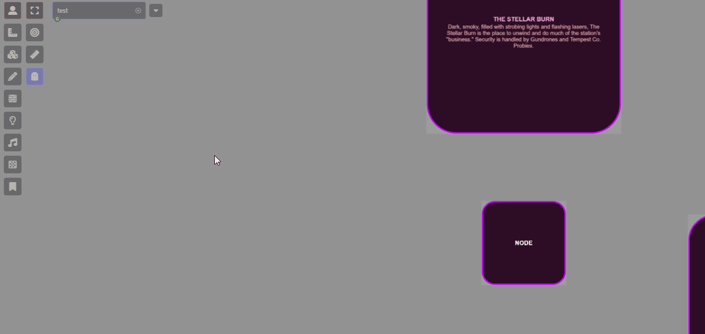
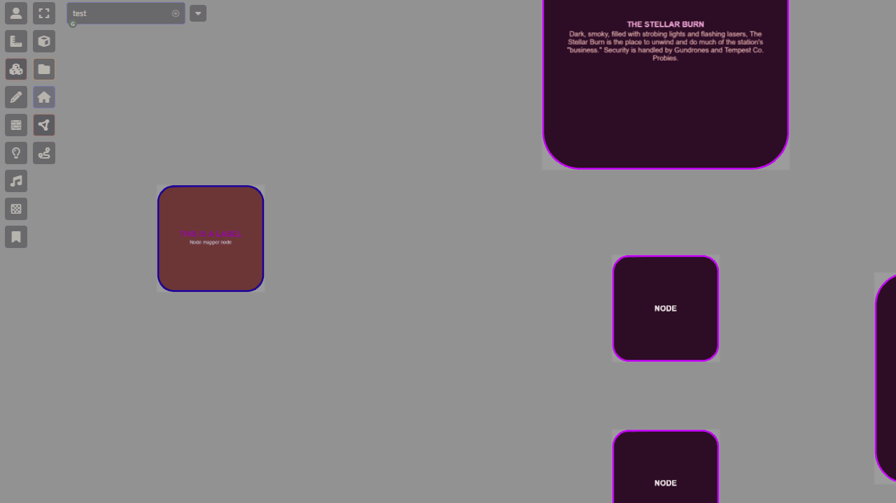
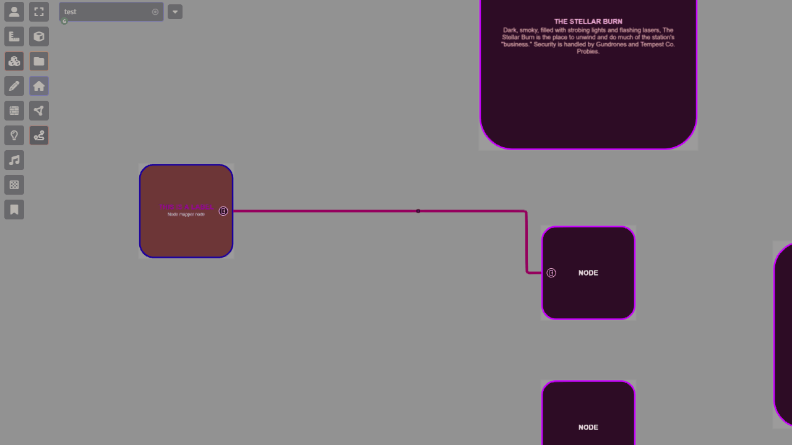
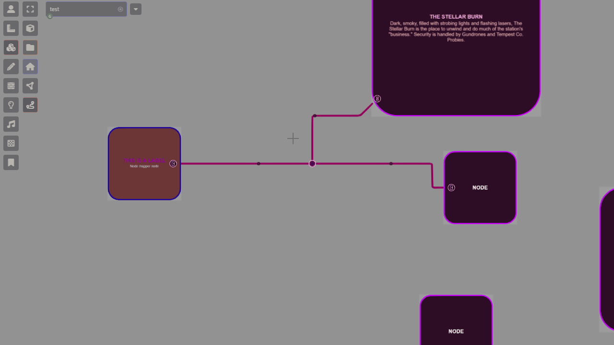
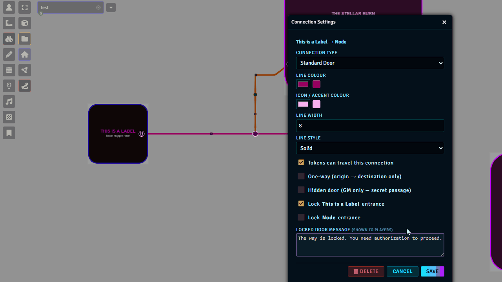

# Derelict Node Mapper

A Foundry VTT v13+ module for building abstract network maps — room nodes connected by corridor lines — directly on the canvas. Designed for sci-fi, dungeon crawl, and any setting where players navigate between named locations along discrete paths rather than walking freely through open space.

All node and connection data is stored in scene flags. Fog of War is handled by auto-generated Wall documents and a lightweight scout token that reveals the path ahead as a player dot travels along it.

> **Compatibility:** Foundry VTT v13–v15 · Tested with the Mothership RPG system

---

## Table of Contents

1. [Concepts](#concepts)
2. [Installation](#installation)
3. [GM Workflow](#gm-workflow)
   - [Placing Nodes](#placing-nodes)
   - [Creating Connections](#creating-connections)
   - [Junction Waypoints](#junction-waypoints)
   - [Editing Nodes & Connections](#editing-nodes--connections)
   - [Canvas Utilities](#canvas-utilities)
4. [Node Configuration](#node-configuration)
5. [Connection Types & Configuration](#connection-types--configuration)
   - [Toll Doors](#toll-doors)
6. [Player Travel](#player-travel)
7. [Transit Map (Fast Travel)](#transit-map-fast-travel)
8. [On Enter Triggers](#on-enter-triggers)
9. [Encounter Checks](#encounter-checks)
10. [License](#license)


---

## Concepts

### Room Nodes
A **room node** is a named location — an airlock, a cargo bay, a reactor chamber. Nodes are drawn as shapes on the canvas with configurable fill, border, and label colours. Each node can optionally generate a bounding **Fog of War wall ring** and an **ambient light**.

### Connections
A **connection** is a corridor or door linking two nodes (or a node to a junction point). Connections are drawn as orthogonal (Manhattan-style) lines with configurable door icons at each room end. Parallel connections running the same route are automatically offset into separate lanes so they remain readable.

### Junction Waypoints
A **junction** is a floating branch point on a connection that is not tied to any room node. Junctions let corridors split and merge. The direction panel shown during travel reads the junction's cardinal arms to present unambiguous navigation choices.

### Player Travel
Players click a door icon on the map canvas to begin traveling a connection. A glowing cyan dot animates along the path. At junctions the dot pauses and shows a **direction panel**. At room nodes the player can enter (teleporting their token) or turn back. A scout token moves ahead of the dot to progressively reveal Fog of War.

---

## Installation

**Manifest URL:**
```
modules/derelict-node-mapper/module.json
```

In Foundry VTT: **Setup → Add-on Modules → Install Module** → paste the manifest URL → Install.

---

## GM Workflow

### Placing Nodes

<!-- GIF-01: Dragging to place a node, dialog opens, fill in label and colors, click Save, node appears on canvas -->


1. Open **Scene Controls** (left toolbar) and select the **Tiles** group.
2. Click the **Place Node** tool — circle-nodes icon.
3. **Click and drag** on the canvas to define the node's size and position. Release to open the configuration dialog.
4. Set the label, shape, colours, and options. Click **Create**.

> The module remembers the last-used style (shape, colours, wall/light settings) and pre-fills them for the next node.

---

### Creating Connections

<!-- GIF-02: Activating Connect tool, clicking node A, clicking node B, dialog opens, choosing type, Save -->


1. Click the **Connect Nodes** tool — route icon — in the Tiles group.
2. **Click a node** to select it as the start point. A notification confirms the selection.
3. **Click another node** (or a junction waypoint on an existing connection) to complete the connection.
4. Configure the connection type, colours, and line style in the dialog. Click **Save**.

> The last-used connection style is remembered for the next connection.

---

### Junction Waypoints

<!-- GIF-03: Clicking an existing connection line to insert a junction, then branching a new connection from it -->


- While in **Connect mode**, **click anywhere on an existing connection line** to insert a junction waypoint.
- **Click the junction** as a start or end point to branch a new connection from it.
- Each junction supports up to 4 connections (one per cardinal direction — N, S, E, W).
- **Drag** a waypoint handle (small dot on the connection) to adjust routing.
- **Click** a waypoint handle to toggle it between a routing hint (invisible to players) and a visible junction.

---

### Editing Nodes & Connections

<!-- GIF-04: Right-clicking a node to open config, changing label, right-clicking a door icon to open connection config -->


- **Right-click** a node to open its configuration.
- **Right-click** a door icon or connection line to open the connection configuration.
- **Drag** a node to reposition it — all attached connections and their walls and lights follow automatically.
- Connections can also be recoloured, retyped, locked, or hidden from the configuration dialog at any time.

---


### Canvas Utilities

Several console commands are available for GM recovery tasks. Open the browser console (`F12`) and run:

| Command | What it does |
|---|---|
| `game.dnm.rebuildAllPaths()` | Force-recalculates every connection route. Run after major edits if travel seems broken. |
| `game.dnm.centerMap()` | Translates the entire node map to the centre of the current canvas. |
| `game.dnm.translateMap(dx, dy)` | Shifts every node, connection, wall, and light by `dx`/`dy` pixels. |
| `game.dnm.undoTranslate()` | Reverses the last `translateMap` or `centerMap` call. |
| `game.dnm.resyncWallsAndLights()` | Deletes and recreates all walls and lights at their current node positions. Run if walls have drifted out of alignment after a canvas resize. |

---

## Node Configuration

Right-click any node to open its settings.

| Field | Description |
|---|---|
| **Label** | Text displayed bold and uppercase on the node. |
| **Label Colour / Size / Offset** | Visual styling for the label. Offset shifts the label vertically. |
| **Description** | Smaller secondary text shown below the label on the node. |
| **Shape** | Circle, Square, Rounded Rectangle, Diamond, or Hexagon. |
| **Width / Height** | Node dimensions in canvas pixels. |
| **Fill / Border Colour** | Node interior and outline colours. |
| **Border Width** | Outline thickness in pixels. |
| **Create FoW Walls** | Whether to generate a Foundry Wall ring around this node for Fog of War. |
| **Fast Travel Hub** | Makes this node appear on the Transit Map bar after a player has entered it. See [Transit Map](#transit-map-fast-travel). |
| **On Enter Actions** | Triggers that fire when a player token enters this node. See [On Enter Triggers](#on-enter-triggers). |
| **Encounter Check** | Random encounter table roll on entry. See [Encounter Checks](#encounter-checks). |

---

## Connection Types & Configuration

Right-click a door icon or connection line to open its settings.

### Connection Types

| Type | Description |
|---|---|
| **Open Corridor** | No door icon. Players pass through freely. |
| **Standard Door** | Door icon. Players can travel through. |
| **Locked Door** | Door icon with lock. Blocked with a "Turn Back" dialogue. |
| **Sealed Bulkhead** | Heavy seal icon. Fully blocked. |
| **Airlock** | Airlock icon. Blocked until GM opens. |
| **Maintenance Hatch** | Hatch icon. Blocked. |
| **Systems Junction** | Junction icon. Open corridor — cosmetic type. |
| **Hidden Door** | Secret icon. Invisible to players until the GM reveals it (eye toggle). |
| **Stairs** | Stairs icon. |
| **Elevator** | Elevator icon. |
| **Toll Door** | Coin icon. Players must pay credits to pass. See below. |

### Connection Options

| Field | Description |
|---|---|
| **Line Colour / Width / Style** | Visual appearance of the corridor line. Style can be Solid, Dashed, or Dotted. |
| **Accent Colour** | Secondary colour used for certain icon details. |
| **Travelable** | Whether players can initiate travel on this connection at all. |
| **One Way** | Travel is only allowed in one direction (first stop → last stop). |
| **Hidden** | Hides the connection from players. The GM sees it with a faded eye toggle icon. |
| **Lock Message** | Text shown to players when they reach a locked/blocked door. |

### Stop Options (per door end)

Each terminal end of a connection (the door that touches a room node) can be individually configured:

| Field | Description |
|---|---|
| **Locked** | Blocks travel at this specific end. The other end may still be open. |
| **Toll Door** | Marks this end as the toll-collection point. |

### Toll Doors


Set the connection type to **Toll Door** and configure:

- **Toll Cost** — credit amount charged to the player.
- **Toll Message** — flavour text shown in the dialogue.
- **One-Time Toll** — once any player pays, the toll is considered paid for everyone permanently.
- **First Stop Toll / Last Stop Toll** — choose which end charges the toll. Setting only one end lets players travel the other direction for free.

The toll is deducted from `actor.system.credits.value`. If the player cannot afford it, the Pay button is disabled and their current balance is shown.

---

## Player Travel


1. **Select your token** on the canvas.
2. **Click a door icon** on the node map. The door icon is visible on the inside edge of the room wall.
3. A glowing cyan dot appears and begins moving along the connection.
4. At **junctions** the dot stops and a direction panel appears — click an arrow to continue.
5. At a **room node** the center button lets you **Enter** (teleporting your token) or use the arrows to turn back.

> **Fog of War:** An invisible scout token travels with the dot, progressively revealing the path. It is automatically removed when travel ends.

> **Locked doors** show a dialogue explaining the door is secured. Only the GM can unlock them by changing the connection configuration.

> **Encounter checks:** If a junction stop or room node has an encounter configured, the roll fires automatically when the dot arrives there — before the direction panel appears. The GM sees the result in chat as a blind roll. Travel continues normally afterward.

---

## Transit Map (Fast Travel)

<!-- GIF-08: GM checking Fast Travel Hub on a node, player entering the room, the transit bar updating with a new station, player clicking a station to fast travel -->


The Transit Map is an L-line style fast travel bar that appears above the Foundry hotbar.

### Setup (GM)

1. Open any node's configuration and check **Fast Travel Hub**.
2. Repeat for every node you want to appear as a transit station.

### Discovery (Players)

A node only appears on a player's transit bar **after they have entered it** via normal travel. This preserves exploration — players cannot fast travel to rooms they have never found.

GMs see all hub nodes regardless of discovery.

### Using the Transit Bar

1. Click the **🚂 train icon** at the bottom-left of the screen to open the transit card.
2. **Select your token** on the canvas.
3. **Click a station circle** (or its label) to fast travel. The canvas fades to black, your token teleports, and the view snaps to the destination.

The card auto-collapses 3 seconds after your mouse leaves it.

### GM Fast Travel Toggle

The GM can **restrict fast travel** at any time — useful for areas where fast travel is narratively unavailable (a lockdown, a blocked transit line, etc.).

Click the **lock icon** in the top-right of the transit card:
- 🔓 **Cyan** — fast travel is available.
- 🔒 **Red** — fast travel is restricted. The card dims and a RESTRICTED badge appears. Players who click a station see a notification and are not moved.

The setting persists across refreshes and is visible to all connected players immediately.

---

## On Enter Triggers



Each node can fire one or more automatic actions when a player token enters it. Any combination can be active at once.

| Trigger | Description |
|---|---|
| **Show Image** | Pops up an image file (handout, room art, etc.) for all players. |
| **Send to Scene** | Redirects players to another Foundry scene (referenced by Scene UUID). |
| **Open Journal** | Opens a journal entry for the entering player. The player is automatically granted Observer permission if they do not already have it. |

To get a Scene UUID: right-click the scene in the sidebar → **Copy UUID**.
To get a Journal Entry ID: right-click the journal entry → **Copy ID**.

---

## Encounter Checks

<!-- GIF-10: Player dot arriving at a junction with an encounter set, GM chat showing the blind roll result, direction panel appearing afterward -->


Encounter checks can be placed on **room nodes** and on **junction stops** along connections. They roll automatically when a player dot arrives at that location during travel — before the direction panel appears, so the GM sees the result while the player decides which way to go.

| Field | Description |
|---|---|
| **Chance %** | Probability (0–100) of triggering the roll on this stop. Set to 0 to disable. |
| **Roll Table ID** | ID of the Foundry RollTable to draw from. Right-click a RollTable in the sidebar → **Copy ID**. |

Encounter results are rolled **blind** — only the GM sees the result in chat. A whispered message also notes which token triggered the roll, so the GM knows whose path caused the encounter even in a multi-player session.

Encounters on **junction stops** fire every time a player passes through that junction, making hazardous corridors feel dangerous even without a room at the end. Encounters on **room nodes** fire on entry.

---

## License

MIT — see [LICENSE](LICENSE)
